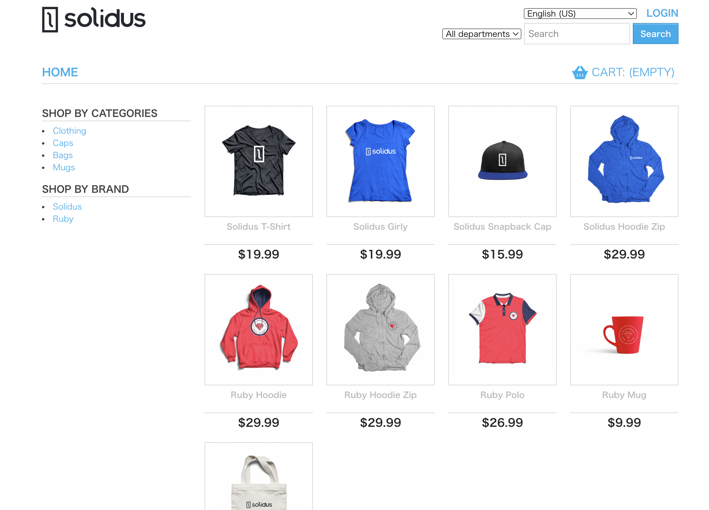
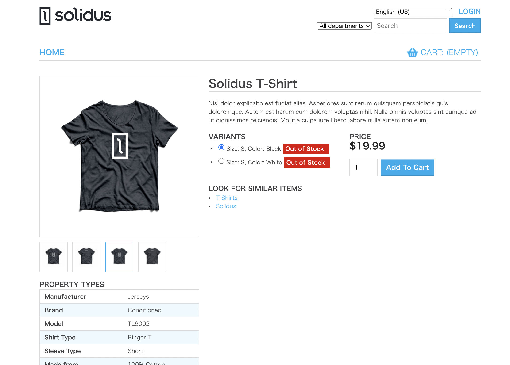

# オンラインショッピングサイト
フレームワークを使用したECサイトを作成しました。 
一覧画面では、商品カテゴリー毎に表示を切り替えることが可能です。 
また商品詳細ページでは、商品のデータ・画像を表示するだけでなく、選択した商品に関連する商品も表示可能です。

* 商品トップページ
  

* 商品詳細ページ
  

# 使用技術
  * Ruby '2.7.7'
  * Ruby on Rails '~> 6.1'
  * JavaScript
  * 'mysql2', '~> 0.5.3'
  * solidus', '~> 2.11.0'
  * rubocop-airbnb
  * Docker
  * Rubocop
  * Bootstrap
  * Rspec
  * Heroku

# システム構成図
  * 開発環境：VS code,docker
  * CI/CD: CircleCI
  * デプロイ環境：Heroku

# 機能一覧
  * 商品一覧ページ
    * 商品名/カテゴリー検索
  * 商品詳細ページ
    * 商品画像の表示
    * 商品データの表示
    * 関連商品の表示
